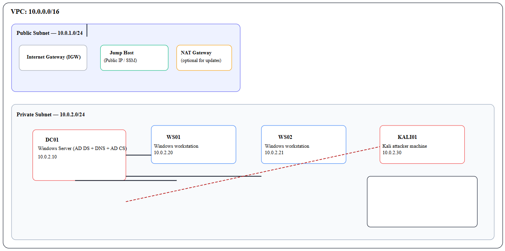

# Active-Directory-Security-Project
## Overview
This repository serves as a documentation for design and deployment of a Windows Active Directory(AD) Lab on AWS. It also Captures the Security Hardening and best practices done to secure the AD environment. Further, it highlights some of the offensive and defensive techniques for exploiting and mitigating AD vulnerabilities.

This repository serves as a documentation for the Step-by-step build up of a Windows Active Directory Lab on AWS. It also Captures the Security Hardening and best practices done to secure the AD environment. Further, it highlights some of the offensive and defensive techniques for exploiting and mitigating AD vulnerabilities.

## 📂 Repository Contents:

1. [Introduction](https://github.com/Zawaddie/Active-Directory-Security-Projects#introduction)
2. [Lab architecture](https://github.com/Zawaddie/Active-Directory-Security-Projects#lab-architecture)
3. [step by step Lab Build]()
4. [AD Defensive measures and Security Hardening Exercises]()
5. [AD Offensive security Test and Pentesting Exercises](https://github.com/Zawaddie/Active-Directory-Security-Projects/blob/main/AD%20Offensive%20security%20Test%20and%20Pentesting%20Exercises.md)
6. [References](https://github.com/Zawaddie/Active-Directory-Security-Projects?tab=readme-ov-file#-references)

## Introduction

Since moving in the professional arena, I’ve ovbserved that Microsoft Active Directory is the dominant solution for managing Windows domain networks within organisations. Because of its central role in the Windows domain management, adversaries are often attracted to discovering and exploiting vulnerabilities in the Active Directory ecosystem.

To continue developing skills as a Systems Security Analyst, I built a simple Active Directory penetration-testing lab on AWS using several online articles and YouTube videos (listed in the references). The aim of the lab is to provide a safe environment where I can practice both offensive and defensive techniques for exploiting and mitigating AD vulnerabilities.

In regard to Windows Domain Management, **A Windows Domain** is a group of users and computers under the administration of a given business. The **Active Directory (AD)** is the single repository that centralises the administration of common components of a Windows computer network with the **Domain Controller (DC)** as  the server that runs the Active Directory services.

The main advantages of having a configured Windows domain in an Enterprise are:

- **Centralised identity management:** All users across the network can be configured from Active Directory with minimum effort.
- **Managing security policies:** You can configure security policies directly from Active Directory and apply them to users and computers across the network as needed.

  
##  Lab Architecture

The lab is built inside a dedicated AWS VPC and contains:

1 Domain Controller (DC01 i.e A Windows Server 2025 promoted to Domain Controller.

2 Window 11 workstations (WS01, WS02) EC2 instances joined to the AD domain.

1 Kali Linux VM as the attacker machine for offensive security practice.

A Jump/Bastion Host in public subnet: for secure access point for RDP/SSH into the private subnet.

#### The lab provides a safe and controlled environment to:

1. Understand how Windows Active Directory works in practice.

2. Explore common AD vulnerabilities exploited by attackers.

3. Practice defensive and hardening strategies for AD.

4. Gain hands-on experience with offensive security tools using Kali Linux.

⚠️ Disclaimer: This project is for educational and lab use only. The captured techniques are not for use in production environments or against systems you don’t own/authorize.

## 📚 References

1. [The CyberMentor’s](https://www.youtube.com/@TCMSecurityAcademy) [How to Build an Active Directory Hacking Lab video](https://www.youtube.com/watch?v=xftEuVQ7kY0)

2. [AWS Documentation: VPCs and Subnets]()

3. [Microsoft Learn: Active Directory Domain Services]()

4. [EC2 Windows Server & Free Tier notes.]() [Amazon Web Services, Inc.](https://aws.amazon.com/windows/products/ec2/?utm_source=chatgpt.com)
   
5. AWS VPC create guide. [AWS Documentation](https://docs.aws.amazon.com/vpc/latest/userguide/create-vpc.html?utm_source=chatgpt.com)

6. Docs on joining EC2 Windows to AD. [AWS Documentation](https://docs.aws.amazon.com/directoryservice/latest/admin-guide/ms_ad_join_instance.html?utm_source=chatgpt.com)
   
7. [Active Directory Monitoring Projects Github Repo](https://github.com/0xrajneesh/Active-Directory-Monitoring-Projects) by [Rajneesh G.](https://www.linkedin.com/in/rajneeshgupta01/)
   
8. [Various other random YouTube tutorials on AD labs & pentesting.]

### 🙋 K. Zeddie
Graduate Electrical & Telecommunications Engineer, Systems & Security Enthusiast and Exploring Cloud and Network Security Architecture.
