# Building a Windows Active Directory Lab on AWS

> Practical design and implementation guide for building a Windows Active Directory lab on AWS for AD Security learning Purposes.
> Consider taking AMIs/snapshots before any offensive testing.

---

## Table of contents
1. [Introduction](#Introduction)
2. [Lab Architecture]()
3. [Step-by-step Lab Build up]()
   - [Step 1: Preparing the AWS account &IAM/Keypair]()
   - [STEP 2: Creating the VPC, subnets and the IGW]()
   - [STEP 3: Creating an IAM role for SSM & EC2]()
   - [STEP 4: Creating the security groups]()
   - [STEP 5: Launching and Preparing the EC2 instances]()
     - [A. Launching EC2: Windows Jump/Bastion Host]()
     - [B. Launching EC2: Domain Controller (DC01)]()
       - [Promoting the DC01 to Domain Controller]()
       - [Install AD Certificate Services (AD CS) on DC01]()
     - [C. Launching EC2: Windows workstations (WS01 & WS02)]()
       -[Joining the windows Workstations, WS01 and WS02, to the domain]()
     - [D. Launching EC2: Kali Linux KALI01)]()
   - [STEP 6: Creating users, OUs, and a shared folder inside the Domain Controller.]()
   - [STEP 7:Making AMIs / Snapshots before offensive testing]()
4. [Clean-up and AWS cost optimization considerations]()
5. [Lab Security Hardening]()
6. [Lab Defensive Measures]()
7. [Lab Offensive Testing]()
9. [References ](#References)

---

## Overview & Purpose
This Directory and Writeup serves as a documentation for the Design and Implementation of a Windows Active Directory Lab on AWS. It also Captures the Security Hardening and best practices done to secure the AD environment. Further, it highlights some of the offensive and defensive techniques for exploiting and mitigating AD vulnerabilities

---

---

## Introduction
For an enterprise with a number of users and computers in its network, it would be quite difficult to manage each computer as a separate entity, manually configure policies for each of the users across the network and provide on-site support for everyone. To overcome these limitations, enterprises uses Windows domains.

A Windows Domain is a group of users and computers under the administration of a given business/enterprise. It is a logical grouping of computers, users, and resources (like printers and servers) that share a common database and security policies. Its main purpose is to provide a centralized management of users and resources.

For instance, company.local could be a domain that includes all employee accounts, office PCs, and shared printers.
The core of any Windows Domain is the Active Directory(AD) Domain Service, or rather, we can say that the AD DS is the engine that powers Windows domains. It is a Directory Service developed by Microsoft that organises information about 'objects' (users, groups, computers, etc ) in a network. I.e, the AD keeps the catalogue/database of all users in company.local, their passwords, group memberships and permissions.

So simply put, the Active Directory (AD) is a single repository that centralises the administration of common components of a Windows computer network, with the Domain Controller (DC) as the server that runs the Active Directory services (AD DS).

The main advantages of having a configured Windows domain in an Enterprise are:
Centralised identity management: All users across the network can be configured from Active Directory with minimum effort.
Managing security policies: You can configure security policies directly from Active Directory and apply them to users and computers across the network as needed.

Since moving in the professional arena, I've observed that Microsoft Active Directory is the dominant solution for managing Windows domain networks within organisations. It became a research topic for me for a peiod of about 4 months. One key thing I have noted is that because of its central role in the Windows domain management, adversaries are often attracted to discovering and exploiting vulnerabilities in the Active Directory ecosystem.

To continue developing skills in the Systems Security Analyst domain, I built a simple Active Directory penetration-testing lab on AWS using several online articles, documentations and YouTube videos (listed in the references). The aim of the lab is to provide a safe environment where I can practice both offensive and defensive techniques for exploiting and mitigating AD vulnerabilities.

---

## Lab Architecture
The lab is built inside a dedicated AWS VPC **10.0.0.0/16** and contains:

**1. Subnets:**
- Public subnet **10.0.1.0/24** (Jump/Bation host)
- Private subnet **10.0.2.0/24** (Domain Controller, DC + 2 Windows workstations + Kali)

**2. EC2 instances:**
- **1 Domain Controller (DC01)** i.e A Windows Server 2025 promoted to Domain Controller with the Active Directory + DNS + ADCS (Certificate Authority).
- **2 Windows 11 workstations (WS01, WS02)** EC2 joined to the AD domain.
- **1 Kali Linux VM (KALI01)** as the attacker machine for offensive security practice and AD monitoring.
- **A Jump/Bastion Host (JumpHost)** in public subnet: for secure access point for RDP/SSH into the private subnet.

**3. Security groups and NAT gateway:**
- Security Groups **(SG-DC, SG-Workstations, SG-Kali, SG-Jump)** configured for realistic AD communication (DNS, Kerberos, LDAP, SMB, RPC, RDP) to restrict access .
- A NAT gateway for private instances to reach Internet for updates. This should be optional especially when you want to create a free AWS Lab. When you provision a NAT gateway, you are charged for each hour that your NAT gateway is available and each gigabyte of data that it processes.

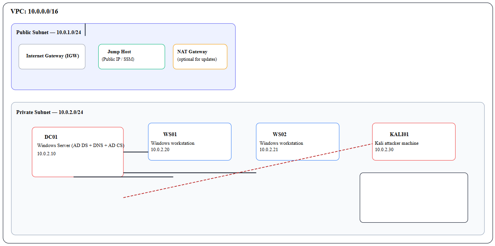
Lab architecture

---

## STEP-BY-STEP LAB BUILD
After full deployment the lab was able to provide a safe and controlled environment to:
- Understand how Windows Active Directory works in practice.
- Explore common AD vulnerabilities exploited by attackers.
- Practice defensive and hardening strategies for AD.
- Gain hands-on experience with offensive security tools using Kali Linux.

⚠️ **Disclaimer:** This project is for educational and lab use only and these the offensive techniques should not be used in production environments or against systems you don't own or authorize.

### STEP 1: Preparing the AWS account & IAM / keypair
- Sign into AWS console using an account with Billing alerts enabled to avoid unanticipated costs.
- Create an IAM user for lab with AdministratorAccess (or use your existing user) and enable MFA.
- Create an EC2 key pair (for RDP via PEM and/or convert to PPK for PuTTY if needed) or prefer Systems Manager (SSM) session when there is no open RDP port.

### STEP 2: Creating the VPC, subnets and the IGW
We start by creating our VPC that will enable our AWS resouces to securely conmmunicate internally or externally.

To do this, we open the AWS VPC console, click **'create VPC'.**

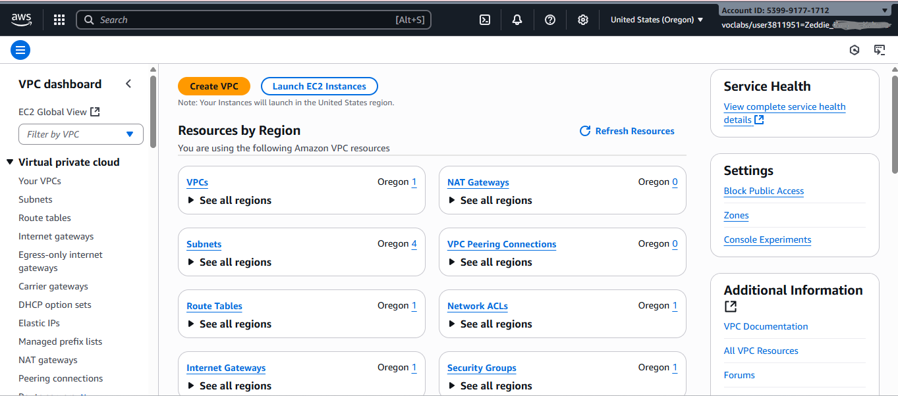

We then add the Name and IPv4 CIDR block.

I used Name tag asAD-PT-Lab-VPC, IPv4 CIDR block: 10.0.0.0/16and Left defaults for IPv6.

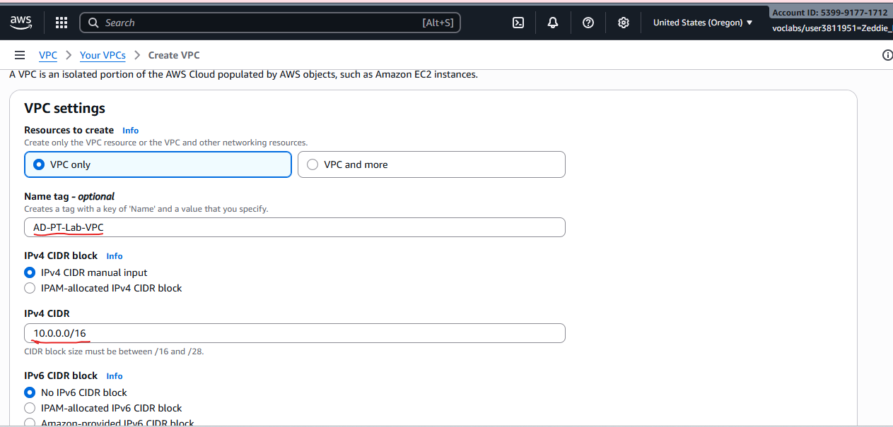

We then complete this by clicking **'Create'.**

Next, we create the two subnets (public and private) in the VPC console by choosing 'subnets' in the left navigation bar

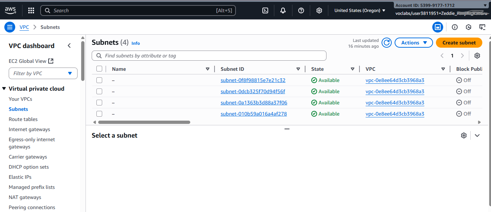

**Subnet 1,** a Public subnet with the name **Public-Subnet-1,** VPC **AD-PT-Lab-VPC**, Availability Zone: your choice, IPv4 CIDR **10.0.1.0/24.**

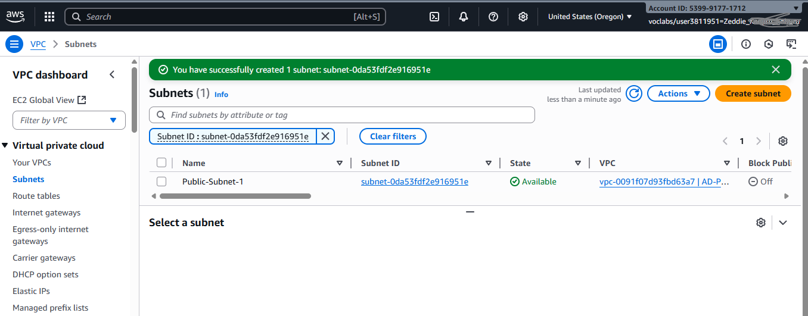

**Subnet 2,** a Private subnet with the name **Private-Subnet-1**  and IPv4 CIDR **10.0.2.0/24.**

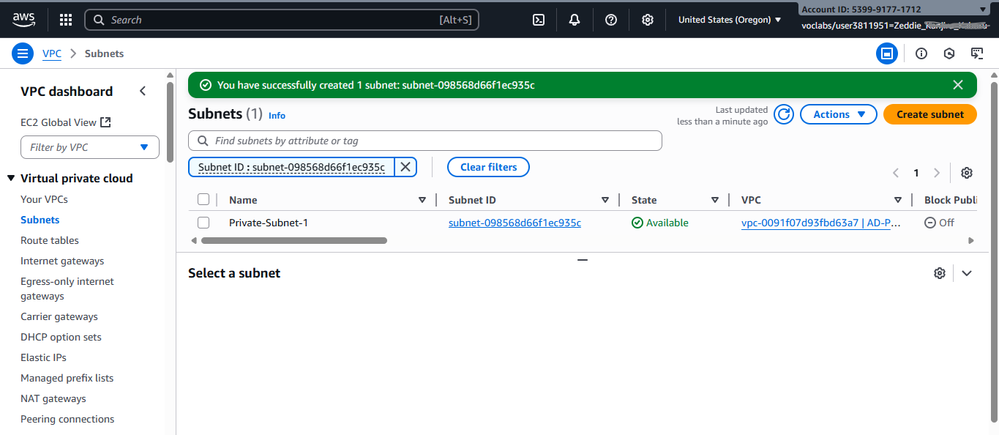

Confirm that the two subnets are added to the list of the available subnets as below.

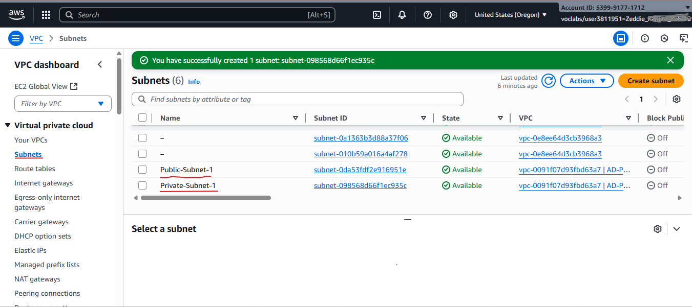

We can then create Internet Gateway and attach to the VPC we have created. In the VPC console, we choose **'Internet Gateways'** in the left navigation bar and **Create Internet gateway:** with the Name as AD-PT-Lab-IGW . Finalize this by clicking **'Create'.**

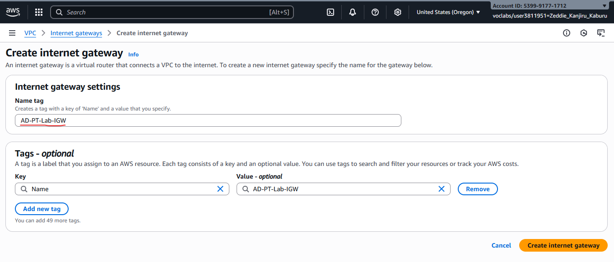

We attach the IGW to the VPC by going to the **'Actions'** tab and clicking on **'Attach to VPC'.**

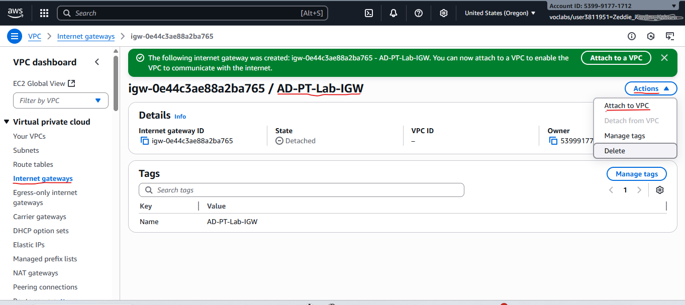

Then choose the VPC we have created, **AD-PT-Lab-VPC** and confirm the IGW has been successfully created as below.

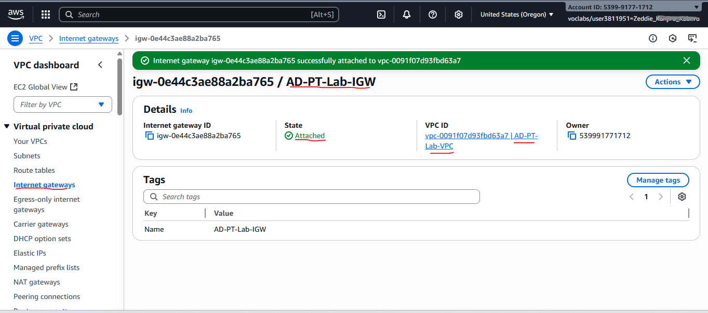

Finaly, to complete step 2, we create the route table for public subnet (0.0.0.0/0, IGW) and associate the public subnet.

To do this, we select Route tables in the left navigation bar of the VPC console and then create a new route table with the name **AD-PT-Lab-RouteTable-01** for our lab's VPC, **AD-PT-Lab-VPC.**

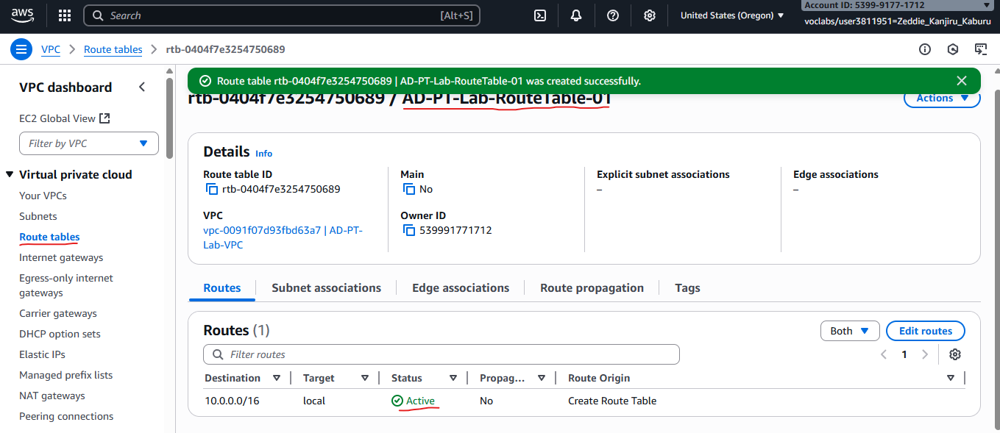

From the list of available **'route tables',** we check the box for the route table we have just created, Choose the **'routes'** tab and click on **'Edit routes'** and **'add route'**.

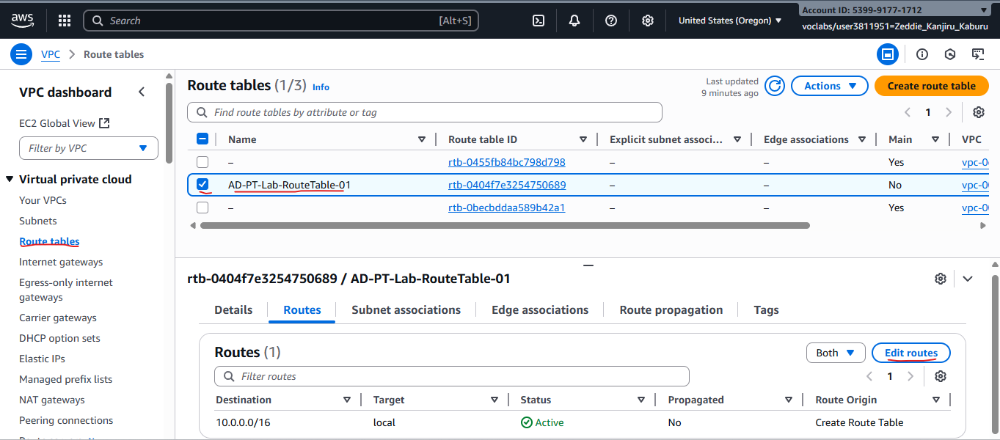

We let the 'add route' details to be **0.0.0.0/0** for destination and Target as our internet gateway that we created **AD-PT-Lab-IGW.** Then we **Save routes.**

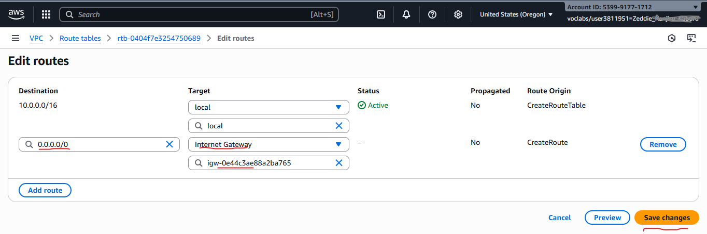

Confirm the route has successfully been added as below.

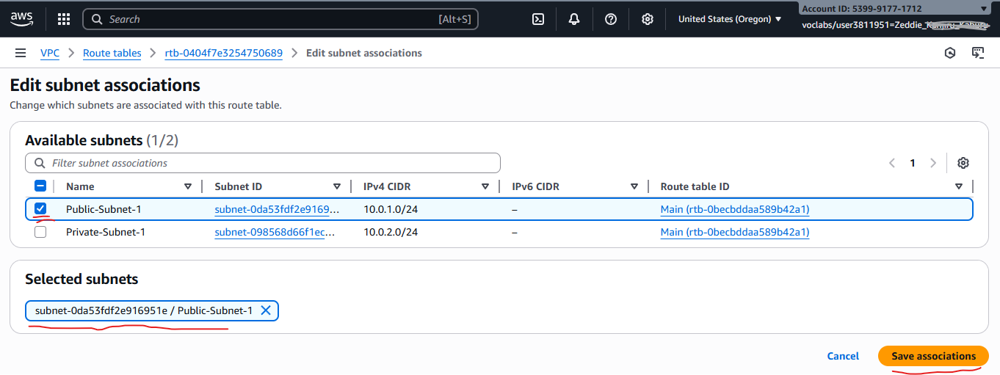

Next, we associate the public subnet **(10.0.1.0/24)** with that route table in the **Subnet associations tab** by clicking **'Edit subnet associations'** checking the box for **Public-Subnet-1 (10.0.1.0/24)**  and then **Saving** the association.

Now that subnet is associated with this route table and all instances launched into that subnet will follow these routes.

**NOTE:** For the private subnet, either set up a NAT Gateway which is [documented](https://medium.com/r/?url=https%3A%2F%2Fdocs.aws.amazon.com%2Fvpc%2Flatest%2Fuserguide%2Fnat-gateway-pricing.html) to be costly since you are charged for each hour that your NAT gateway is available and each gigabyte of data that it processes when you provision a NAT gateway. To avoid NAT charges, we opt to using Systems Manager as the cheaper option.

For the private subnet, leave the route to the IGW off (you can optionally add NAT later). This isolates private instances from unsolicited inbound internet traffic.

### STEP 3: Creating an IAM role for SSM & EC2
Here, we create an IAM role that we will attach to each of the EC2 instances for the Domain Controller, Windows workstations and Kali Linux so that we can be able to use the AWS Session Manager without having to open RDP or SSH.

We navigate to the AWS IAM Console, chose **'Roles'** and click on **'Create role'**. For Trusted entity: AWS service, we select EC2 and click **'Next'.**

Then, we can attach permission policies by searching and attaching **AmazonSSMManagedInstanceCore.** Optionally, we can also add **AmazonSSMDirectoryServiceAccess** to enable directory integration for SSM. 

We click **'Next'** and add the Name role: **LabRole** and complete the reol creation process by clicking **'Create role'.**

Confirm that the role has been created and listed in the available IAM roles as below:

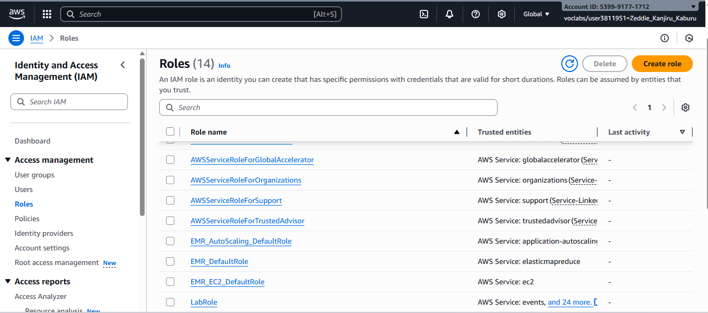

### STEP 4: Creating the security groups
We'll make four Security Groups on the **AWS EC2 Console** by choosing 'Security Groups' on the Left Nav bar and then clicking on **'Create security group'.**

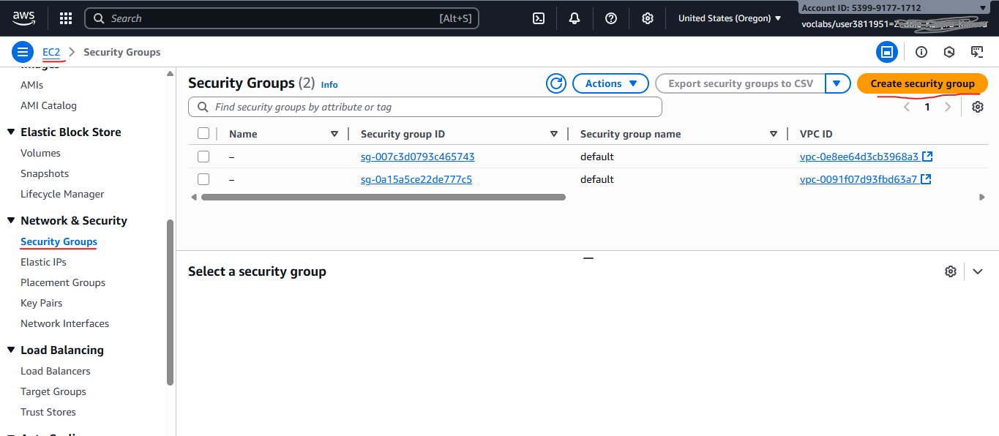

**A. SG-DC**
We create a Security group for **DC01** with the Name: **SG-DC** and VPC: **AD-PT-Lab-VPC.**

For Inbound rules, we choose source type as **'Security Group where appropriate'** and click on **'Add rule'** and for type choose **'Allow All traffic from source = SG-Kali'**. (I added **this later once SG-Kali exists.**) Do not allow 0.0.0.0/0 inbound.
For Outbound rules, keep the default rule allow all, which allows all outbound traffic.

SG-DC currently only allows AD ports and not RDP, add an SG-to-SG rule:
- Edit SG-DC inbound → Add rule:
- Type: RDP (TCP 3389)
- Source: Custom → choose Security group and pick SG-Jump
- Save.

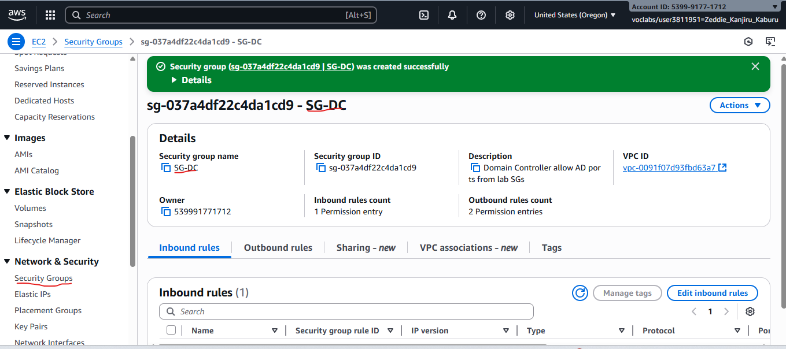

For Outbound rules, keep the default rule allow all, which allows all outbound traffic.

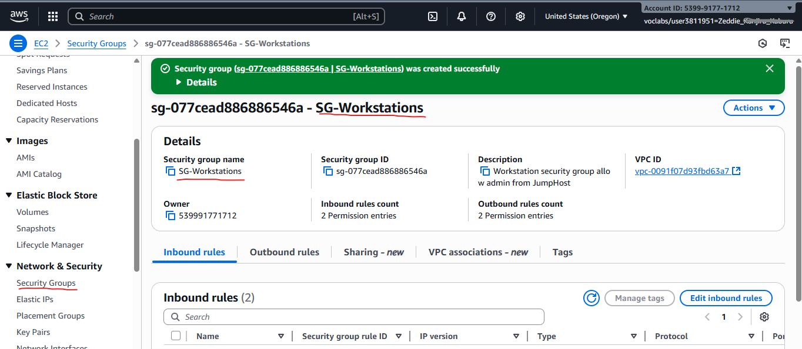

**B. SG-Workstations**
We then Click **'Create security group'** again and create a Security group for the workstations, **WS01** and **WS02** with the Name: **SG-Workstations,** Description: **Workstation security group that allow admin from JumpHost** and VPC: **AD-PT-Lab-VPC**.

For Inbound rules we Allow inbound: **RDP (TCP 3389)** from **SG-Jump** so that we can be allowed to RDP through the jump/Bastion host when not using the SSM. The details should be Type: **RDP (TCP 3389)** and the Source type: **Custom.** From the selector that appears after choosing **Security group** in the **'source box'** we type **SG-Jump** and select it.

This creates an SG-to-SG rule that allows RDP only from instances using **SG-Jump.**

We add another inbound rule to allow to attack the windows workstations with the details Type: **Custom** (or select protocol(s) you expect Kali to use). From the selector that appears after choosing Security group in the **'source box'** we type **SG-Kali** and select it. 

For Outbound rules, keep the default rule allow all, which allows all outbound traffic.

We click on Create security group and Verify a successful creation of **SG-Workstations.**

**C. SG-Kali**
We again click **'Create security group'** and create a Security group for the Kali instance, with the Name: **SG-Kali** and VPC: **AD-PT-Lab-VPC**

For inbound rules, we allow none from Internet and allow inbound from **SG-Jump** only to administer Kali from jump host when not using SSM-like access for Linux.

For outbound rules, we allow all to **SG-DC** and **SG-Workstations** to enable perform security tests.

We click on Create security group and Verify a successful creation of **SG-Kali.**

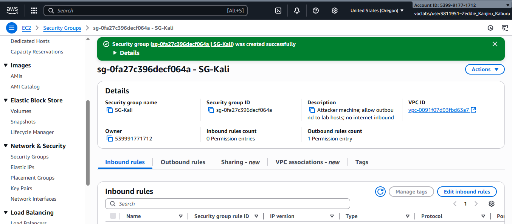

**D. SG-Jump**
For the last security Group, we again click 'Create security group' and create a Security group for the bastion / jump host, with the Security group name: SG-Jump, Description: Bastion host access to allow RDP from admin IP only and VPC: select AD-Lab-VPC

For Inbound rules, click Add rule. Then add the details Type: RDP, Protocol / Port range: auto-filled TCP 3389,Source type: My IP so as to auto-fills the current public IP as x.x.x.x/32.We leave any other inbound rules blank. Do not allow 0.0.0.0/0 inbound.

For Outbound rules we leave default All traffic ie 0.0.0.0/0.
We click on Create security group and Verify a successful creation of **SG-Jump** with the Inbound tab should showing RDP from our IP.

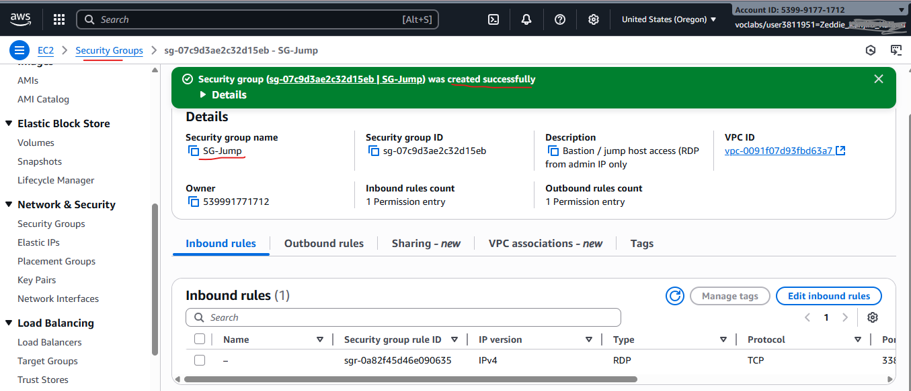

Use security-group-to-security-group rules (source: the other SG) rather than open CIDR blocks.

### STEP 5: Launching and Preparing the EC2 instances
A. Launching EC2: Domain Controller (DC01)
Launch a Windows Server AMI (Windows Server 2019/2022) in the private subnet for the DC. Instance type: t2.micro or t3.micro (free-tier eligible if your account qualifies). Give it a name: DC01.
Console → Services → EC2 → Instances → Launch instances. AWS Documentation
Choose AMI: Search for Windows Server 2025 Base (use a region-specific official Microsoft AMI).
Choose Instance Type: For free-tier eligible accounts choose t2.micro or t3.micro only if your account has Windows free-tier hours; Windows can be heavy so t2.micro may be slow - prefer t3.small if you have credits. (Check Billing). AWS Documentation
Configure Instance:
Network: AD-Lab-VPC
Subnet: Private-Subnet-1 (10.0.2.0/24)
Auto-assign Public IP: Disable (no public IP)
IAM role: attach EC2-SSM-Role-ADLab created earlier (so you can use Session Manager).
Advanced details: (leave defaults).

Storage: 30–50 GB recommended for Windows.
Tags: add Name = DC01
Security group: Select SG-DC (created earlier). If you need to temporarily RDP, you can change SG later or RDP via the jump host only.
Launch and skip key pair selection if you'll use Session Manager; or create/select a key pair if you want the RDP password decryption flow. (You can still use SSM to get console access). AWS Documentation+1

Launch a jump host in the public subnet (Windows or Linux) with its own SG. If you want to avoid opening RDP, enable SSM Session Manager by attaching an instance profile with AmazonSSMManagedInstanceCore and installing the SSM Agent (most recent Windows AMIs have it).
Docs: EC2 Windows & free tier details. Amazon Web Services, Inc.+1
Promoting the DC01 to Domain Controller
We then prepare the DC instance as below:
Connect to DC01 via Session Manager: EC2 → Instances → Select DC01 → Connect → Session Manager → Connect. (If you prefer RDP: use your jump host to RDP to private IP, or temporarily enable RDP from your IP). AWS Documentation
On the Windows Server Desktop: Open Server Manager → Add roles and features → Next → Role-based or feature-based installation → Select server DC01 → Active Directory Domain Services + DNS Server → Add features when prompted → Next → Install.
After install, in Server Manager flag "Promote this server to a domain controller" → Select Add a new forest → Root domain name: lab.local → Accept defaults (or configure NetBIOS LAB) → Set Directory Services Restore Mode password → Install → Server will reboot and DC01 will be domain controller and DNS. (Same flow as the Medium / YouTube references). AWS Documentation+1

After reboot, logon to the domain (lab\\Administrator). (This is identical to the video/Medium method)
Prepare DC instance (initial Windows steps)
Connect (RDP or SSM).
In Server Manager: Add roles and features → install Active Directory Domain Services and DNS Server (or use PowerShell).
Rename the server to DC01 (recommended) and restart.

PowerShell (on the Windows server) to install AD DS and create a new forest in one go:
# run as Administrator PowerShell
Install-WindowsFeature AD-Domain-Services -IncludeManagementTools
Import-Module ADDSDeployment
$securePwd = ConvertTo-SecureString "P@ssw0rd!" -AsPlainText -Force
Install-ADDSForest `
 -DomainName "lab.local" `
 -CreateDnsDelegation:$false `
 -DatabasePath "C:\\Windows\\NTDS" `
 -DomainMode "Win2012R2" `
 -DomainNetbiosName "LAB" `
 -ForestMode "Win2012R2" `
 -LogPath "C:\\Windows\\NTDS" `
 -SysvolPath "C:\\Windows\\SYSVOL" `
 -InstallDns:$true `
 -SafeModeAdministratorPassword $securePwd `
 -Force
The system will reboot and complete the promotion. (This is the same flow shown in the video). YouTube

Install AD Certificate Services (AD CS) on DC01
Server Manager → Add roles and features → select Active Directory Certificate Services → add Certification Authority.
After install, in the post-deployment configuration, configure AD CS as an Enterprise Root CA → create a new key with default crypto settings → set validity (e.g., 5 years). Reboot if requested. (This gives you a lab CA for certificate-based exercises.) AWS Documentation

B. Launching EC2: Windows workstations (WS01 & WS02)
For each workstations (repeat twice):
EC2 → Launch instance.
AMI: Choose a Windows 10/11 or Windows Server image configured as a client (if your account/region has Windows client AMIs - else use Server).
Instance type: t3.micro/t3.small depending on availability.
Network: AD-Lab-VPC → Subnet: Private-Subnet-1 → Auto-assign Public IP: Disable.
IAM Role: EC2-SSM-Role-ADLab.
Security group: SG-Workstations.
Tags: Name = WS01 (or WS02). Launch.

Joining the windows Workstations, WS01 and WS02, to the domain
Connect via Session Manager (or via Jump Host RDP). Once on the instance:
Set the DNS server to the DC's private IP (10.0.2.10). (Control Panel → Network → Adapter → IPv4 → set Preferred DNS).
Join domain: System → Change → Domain = lab.local OR run PowerShell:

Add-Computer -DomainName "lab.local" -Credential (Get-Credential) -Restart
Use the domain credentials you'll create on the DC (or use the domain Administrator). AWS Documentation

C. Launching EC2: Kali attacker (KALI01)
EC2 → Launch instance → AWS Marketplace → Search Kali Linux (official or trusted image). Select the AMI and Accept terms.
Instance type: t3.small or t3.medium (attacks can require CPU).
Network: AD-Lab-VPC → Subnet: Private-Subnet-1 → Auto-assign Public IP: Disable.
IAM role: optional EC2-SSM-Role-ADLab if you want to manage via SSM (for Linux SSM support exists).
Security group: SG-Kali. Launch.
Connect via SSM or via jump host (SSH/RDP proxy) and ensure Kali's DNS is set to DC (10.0.2.10) so it can resolve lab.local and find domain services (SRV records). This mirrors the attacker machine in Kamran's lab. AWS Documentation

STEP 6: Creating users, OUs, and a shared folder inside the Domain Controller.
On DC01 → Server Manager → Tools → Active Directory Users and Computers.
Create OU Users or Workstations as you prefer. Create domain users (e.g., pparker, fcastle) with lab passwords.
Create a shared folder on DC01 (or a file server): C:\\hackme → right-click → Properties → Sharing → Advanced Sharing → Share name hackme → set permissions. This reproduces the shared resources from Kamran's lab and is useful for practicing ACL attacks.

STEP 7:Making AMIs / Snapshots before offensive testing
EC2 → Instances → select DC01 → Actions → Image and Templates → Create image (AMI).
Repeat for WS01 and WS02. Keep AMIs handy so you can restore servers quickly if your attacks break AD. (This is crucial.) AWS Documentation

---

Clean-up and AWS cost optimization
Stop instances when not in use (stopped Windows instances still incur EBS storage charges).
Delete unused EBS volumes, snapshots, NAT Gateways (NAT gateway costs are significant).
Use AWS cost explorer and set billing alerts.

Lab's design and deployment summarized checklist: 
Create VPC 10.0.0.0/16. (VPC console). AWS Documentation
Create subnets: public 10.0.1.0/24, private 10.0.2.0/24. 
Create IGW and attach; set public route table to IGW. 
Create SGs: SG-DC, SG-Workstations, SG-Kali, SG-Jump. 
Create IAM role EC2-SSM-Role-ADLab. 
Launch DC01 (Windows Server) into private subnet with SSM role. 
Promote DC with Server Manager or PowerShell. 
Launch WS01/WS02, join domain. 
Launch KALI01 (Marketplace AMI) in private subnet. 
Create AMIs of DC & workstations before testing. 

---

